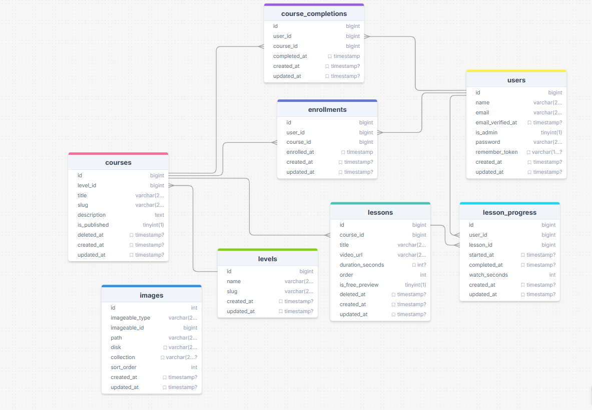

# 🏗️ System Architecture: Career 180 LMS Quest

This document outlines the high-level architectural decisions, design patterns, and technical strategies implemented in the **Career 180 Quest**. This project is designed as a **Modern Monolith**, prioritizing developer velocity without sacrificing the scalability or data integrity required for an educational platform.

---

### 1. 🏗️ Architectural Overview
The system is built on the **TALL Stack** (Tailwind, Alpine.js, Laravel, Livewire) combined with **Filament v3**. 

*   **Laravel 12** provides the robust service-provider-based backend.
*   **Livewire v3** handles reactive UI states without the overhead of a separate SPA framework.
*   **Filament v3** serves as the administrative engine, allowing for rapid deployment of complex relational management (Levels, Courses, Lessons, Enrollments) using a schema-driven approach.

This stack was chosen to ensure a cohesive "Full-Stack" experience where the backend and frontend share a unified state, reducing the complexity of API versioning and client-side hydration.

---

### 2. ⚡ Concurrency & Idempotency (The Core Engine)
In an LMS, tracking progress is a high-frequency operation. To prevent race conditions—such as a user double-clicking a "Complete" button or a network retry triggering duplicate logic—the system employs an **Idempotent Action Strategy**.

*   **Atomic Transactions:** All progress-marking logic is wrapped in `DB::transaction`. This ensures that updating `lesson_progress` and the subsequent check for `course_completions` either succeed or fail as a single unit.
*   **Application-Level Guardrails:** We utilize Eloquent's `firstOrCreate` and `updateOrCreate` methods. If a user attempts to complete a lesson twice, the system simply retrieves the existing record rather than creating a duplicate.
*   **Single-Dispatch Events:** The `CourseCompletionEmail` is dispatched only if a new record is successfully created in the `course_completions` table (`wasRecentlyCreated`). This prevents duplicate notifications during rapid status changes.

---

### 3. 🛠️ The Action Classes Pattern
We have decoupled the core business logic from Controllers and Livewire components into **Single-Responsibility Action Classes**.

*   **Design Choice:** Every major flow (e.g., `EnrollUserAction`, `MarkLessonCompletedAction`) is an invokable class.
*   **Benefits:**
    *   **Entry-point Agnostic:** The same logic used in a Livewire component can be called from a CLI command, a Scheduled Task, or a REST API endpoint.
    *   **Testability:** Actions are easily unit-tested in isolation, mocking only the necessary dependencies.
    *   **Maintainability:** By removing logic from the UI layer, we prevent the "Fat Controller" anti-pattern and ensure that business rules are defined in a single, discoverable location.

---

### 4. 🗄️ Database Constraints & Soft-Delete Strategy
Data integrity is enforced at the persistence layer to act as the final line of defense.

*   **Composite Unique Constraints:** Tables like `enrollments` and `lesson_progress` utilize composite unique indexes (e.g., `unique(['user_id', 'course_id'])`). This prevents data duplication at the engine level (MySQL/PostgreSQL).
*   **Soft-Delete Aware Unique Slugs:** Standard Laravel unique constraints often conflict with `SoftDeletes`. 
    *   **The Strategy:** We implemented a **Model Observer** on the `Course` model. 
    *   **The Logic:** Upon the `deleting` event, the system appends `::deleted::{timestamp}` to the record's `slug`. This effectively "frees up" the original human-readable slug for a new record while preserving the historical data of the deleted one.

---

### 5. 🖥️ Frontend Architecture (Alpine.js + Livewire + Plyr)
The frontend implements a **Hybrid State Management** approach to optimize server roundtrips and UI performance.

*   **Avoiding `wire:poll`:** We explicitly avoided using Livewire's polling for video tracking. Polling creates unnecessary server load and jittery UI updates for high-frequency data like video timestamps.
*   **Alpine.js Interop:** We use **Alpine.js** as a client-side bridge for the **Plyr.io** player. 
    *   **Throttled Sync:** Alpine hooks into Plyr’s `timeupdate` event but only triggers a `$wire.updateWatchSeconds()` call every **10 seconds**. This significantly reduces XHR overhead.
*   **DOM Preservation:** The player container utilizes `wire:ignore`. This is critical to prevent Livewire’s DOM-diffing algorithm from re-rendering the video element (and thus resetting the buffer/playback) whenever a server-side state update occurs.
*   **Event-Driven UI:** UI feedback (like progress bar updates) is handled via browser events (`@progress-updated.window`), allowing the backend to push updates that Alpine.js renders instantly without a full component refresh.
