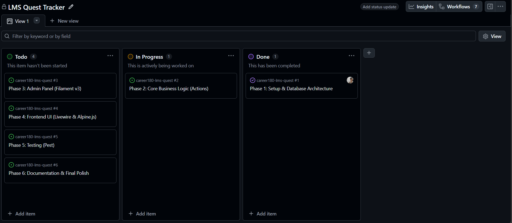
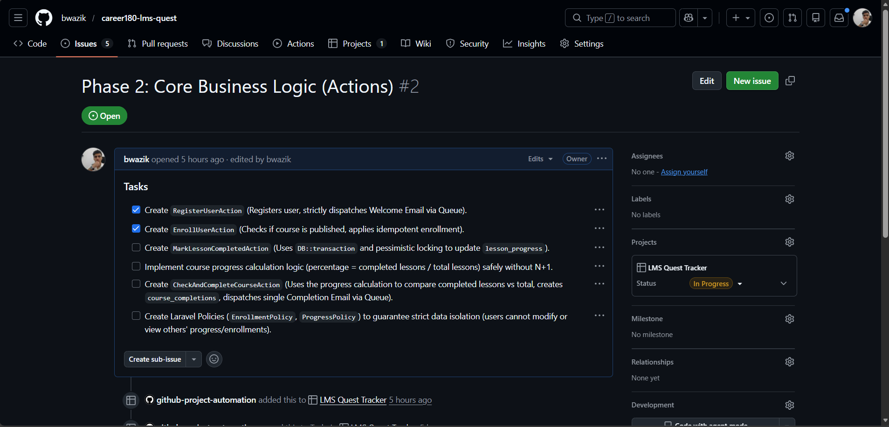
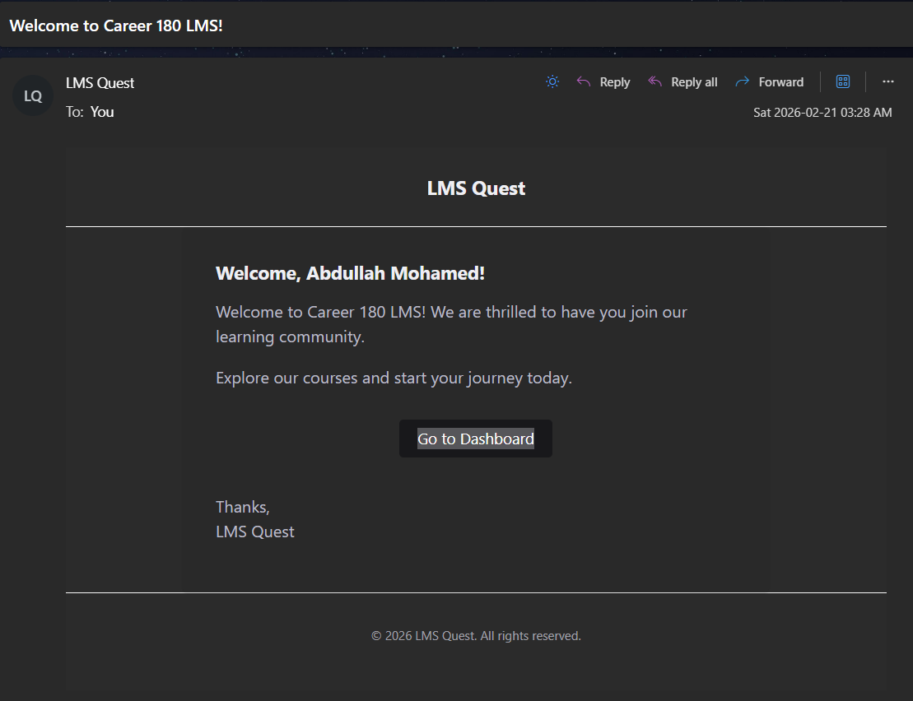
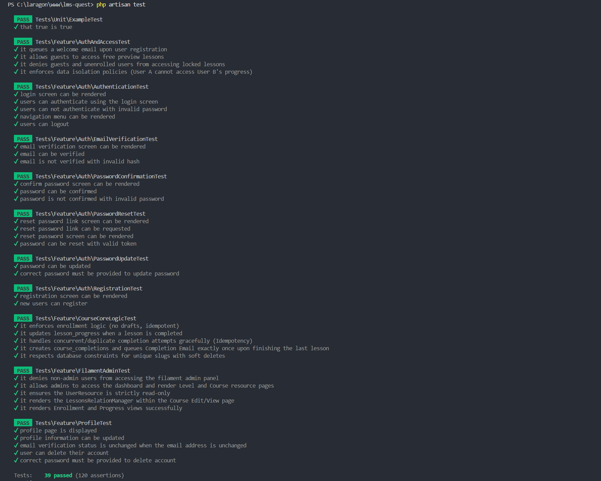

# 🎓 Career 180 LMS Quest

[](https://laravel.com)
[](https://livewire.laravel.com)
[](https://tailwindcss.com)
[](https://pestphp.com/)

A high-performance Mini-LMS built for the **Career 180 Quest**. This project demonstrates a production-ready architecture focusing on data integrity, idempotent business logic, and a seamless "Theater Mode" user experience.

---

## 🚀 Live Demo & Credentials

**Live URL:** https://career180.shattor.com
**Admin Panel:** `/admin`

| Role | Email | Password |
| :--- | :--- | :--- |
| **Admin** | `youwillhireme@career180.com` | `iwillhireyou` |
| **Student** | `youwillhiremealso@career180.com` | `iwillhireyou` |

---

## 📸 Agile Workflow & Visual Overview

To ensure 100% compliance with the Career 180 Quest requirements, this project was managed using strict Agile methodologies. Every feature was broken down into granular tasks and tracked systematically.

| 🗂️ Kanban Project Board | 📋 Detailed Task Tracking |
| :---: | :---: |
|  <br> *High-level tracking of features across Pending, In Progress, and Done columns.* |  <br> *Granular task breakdowns inside GitHub Issues ensuring no requirement is missed.* |

<br>

| ✉️ Automated Email Delivery |
| :---: |
|  <br> *Polished Welcome Email automatically queued and delivered upon student registration.* |
---

## 🛠️ Technical Highlights

This submission goes beyond basic CRUD functionality by implementing several senior-level architectural patterns:

*   **⚡ Idempotent Action Pattern:** Core business flows (Enrollment, Registration, Progress Tracking) are encapsulated in single-responsibility, invokable Action classes. These utilize database transactions and `firstOrCreate` logic to ensure system stability even under rapid-fire or concurrent requests.
*   **🎥 Alpine.js & Plyr Hybrid:** Video progress is managed via Alpine.js bridge to Plyr.io. Progress is tracked client-side and synced to the Laravel backend using throttled updates (every 10 seconds) to minimize server load while maintaining accuracy.
*   **🔗 Unique Slug Soft-Delete Handling:** Solved the "Unique Constraint vs. Soft Delete" conflict by implementing a model observer that appends a timestamp to slugs upon deletion, allowing original slugs to be reused immediately while preserving data history.
*   **🌍 Global Timezone Strategy:** All timestamps are stored in **UTC**. The frontend utilizes a custom Alpine.js `local-time` component to detect the user's browser timezone and format timestamps locally via the `Intl.DateTimeFormat` API.

---

## 💻 Local Setup

Follow these steps to get the project running locally:

1.  **Clone the repository:**
    ```bash
    git clone https://github.com/bwazik/lms-quest.git
    cd lms-quest
    ```

2.  **Install dependencies:**
    ```bash
    composer install
    npm install
    ```

3.  **Environment configuration:**
    ```bash
    cp .env.example .env
    php artisan key:generate
    ```

4.  **Database & Seeding:**
    Configure your `.env` database settings, then run:
    ```bash
    php artisan migrate --seed
    ```
    *Note: The seeder creates 1 Admin, 1 User, 3 Difficulty Levels, and 3 Courses with a mix of free previews and locked content.*

5.  **Compile assets & Start server:**
    ```bash
    npm run dev
    php artisan serve
    ```

---

## ✅ Testing (Pest PHP)

The test suite is exhaustive, covering core logic, authorization policies, and database constraints.

```bash
php artisan test
```



**Test Coverage Highlights:**
*   **Idempotency:** Verifies that rapid enrollment or completion attempts do not create duplicate records.
*   **Data Isolation:** Ensures students cannot access or modify progress data belonging to other accounts.
*   **Concurrency:** Validates transactional consistency between lesson completion and course-wide graduation.

---

## 📝 Assumptions & Limitations

*   **Linearity:** Students can navigate lessons freely within a course. While progress is tracked, strict "Lesson Locking" (requiring Lesson 1 to finish before Lesson 2) was omitted to enhance the user's learning flexibility.
*   **Payments:** The enrollment flow is "Open Access." While the UI supports an enrollment trigger, payment gateways are omitted as the focus was on the core LMS logic and progress engine.
*   **Storage:** Course images and videos are served locally for the prototype. In a production environment, these would be offloaded to an S3-compatible bucket.

---

## 🔮 If I had more time...

Given more time, I would focus on implementing the following pragmatic enhancements to make the platform fully production-ready for a broader audience:

1. **Localization & Multi-Language Support (AR & EN):** Implement full localization support (Arabic/English) to make the platform accessible to the MENA region, including adapting the Tailwind CSS layout for seamless RTL (Right-to-Left) experiences.
2. **Progress Caching Strategy:** Instead of calculating course progress dynamically on-the-fly, I would introduce a caching layer (e.g., using Redis or Database) or store denormalized progress values. This would significantly optimize database queries and load times as the student base grows.
3. **Cloud Video Hosting & Security:** Migrate video assets from local storage to a secure cloud provider (such as AWS S3 or Bunny) utilizing signed URLs. This would enhance asset security, prevent unauthorized downloads, and provide more robust telemetry for exact watch-time tracking.
